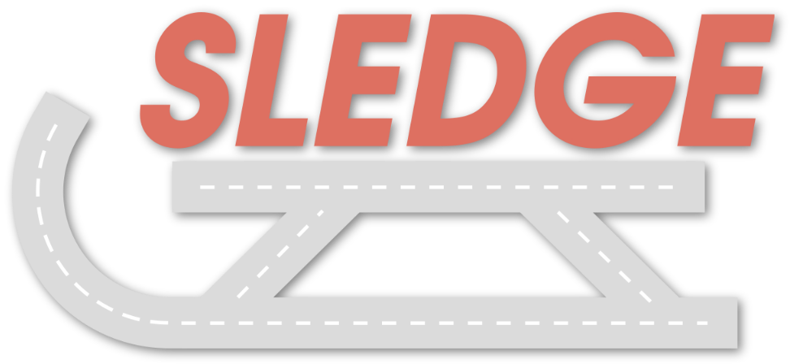

<p align="center">
    
    <h1 align="center">Generative Simulation for Vehicle Motion Planning</h1>
    <h3 align="center"><a href="https://arxiv.org/abs/xxxx.xxxx">Paper</a> | Supplementary | Video  </h3>
</p>

<br/>

> [**SLEDGE: Synthesizing Simulation Environments for Driving Agents with Generative Models**](https://arxiv.org/abs/xxxx.xxxx) <br>
> [Kashyap Chitta](https://kashyap7x.github.io/), [Daniel Dauner](https://danieldauner.github.io/), and [Andreas Geiger](https://www.cvlibs.net/) <br>
> University of Tübingen, Tübingen AI Center
> <br>
>

This repo contains SLEDGE, the first generative simulator for vehicle motion planning trained on real-world driving logs. We publicly provide our code for simulation, evaluation, and training (including pre-trained checkpoints). 

<br/>

<!-- https://github.com/autonomousvision/sledge/assets/... -->

## News
* **`27 Mar, 2023`:** We released our paper on [arXiv](https://arxiv.org/abs/xxxx.xxxx). Code and models are coming soon, please stay tuned!

<br/>

## Overview

- SLEDGE is a generative simulator, able to synthesize agent bounding boxes and lane graphs, which serve as an initial state for traffic simulation.

- The unique properties of the entities to be generated for SLEDGE, such as their connectivity and variable count per scene, render the naive application of most modern generative models to this task non-trivial.

- Therefore, we introduce a novel raster-to-vector autoencoder (RVAE). It encodes agents and the lane graph into distinct channels in a rasterized latent map. This facilitates both lane-conditioned agent generation and
combined generation of lanes and agents with a Diffusion Transformer.

- Using generated entities in SLEDGE enables greater control over the simulation, e.g. long routes, upsampling turns, or increasing traffic density. SLEDGE presents new challenges for planning algorithms, evidenced by failure rates of over 40% for PDM, when tested on hard routes and dense generated traffic.

- Compared to nuPlan, SLEDGE requires 500× less storage to set up (<4GB), making it a more accessible option and helping with democratizing future research in this field.

<br/>

## TODO
- [ ] Code release 
- [ ] Supplementary material & video
- [x] Initial repository & preprint release

## Contact
If you have any questions or suggestions, please feel free to open an issue or contact us (daniel.dauner@uni-tuebingen.de).

## Citation
If you find SLEDGE useful, please consider giving us a star &#127775; and citing our paper with the following BibTeX entry.

```BibTeX
@InProceedings{Chitta2024ARXIV,
  title={SLEDGE: Synthesizing Simulation Environments for Driving Agents with Generative Models},
  author={Chitta, Kashyap and Daniel, Dauner and Geiger, Andreas},
  journal={arXiv},
  volume={xxxx.xxxx},
  year={2024}
}
```

## Other resources <a name="otherresources"></a>

<a href="https://twitter.com/AutoVisionGroup" target="_blank">
    
  </a>
  
- [NASVIM](https://github.com/autonomousvision/navsim) | [tuPlan garage](https://github.com/autonomousvision/tuplan_garage) | [CARLA garage](https://github.com/autonomousvision/carla_garage) | [Survey on E2EAD](https://github.com/OpenDriveLab/End-to-end-Autonomous-Driving)
- [PlanT](https://github.com/autonomousvision/plant) | [KING](https://github.com/autonomousvision/king) | [TransFuser](https://github.com/autonomousvision/transfuser) | [NEAT](https://github.com/autonomousvision/neat)

<p align="right">(<a href="#top">back to top</a>)</p>